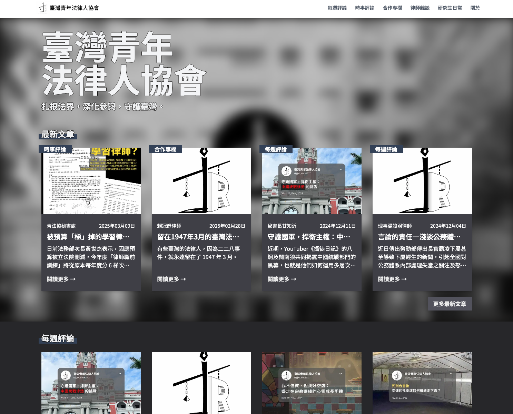

<style>
h3 {
  background-color: #d1d9e0;
  padding: .5rem;
  display: inline-block;
}

table{
 font-size:.7rem;
}
</style>


# 青法協資訊小組工作報告
<hr/>

報告人：江丞晉

---

<!-- header: 一、已完成工作報告 -->
## 一、已完成工作報告✅

---

### 1.網站介紹

臨時網址：[https://bera2017.org](https://bera2017.org)



---

### 2.網站後台

暫時使用 notion：
- 優點：建置成本低、上手容易
- 缺點：靈活性低

未來視業務情況調整是否需要擴充硬體設備或轉移資料庫

---

### 3.開設相關服務並移植

- 開設 github 帳號並串接 vercel, zeabur
- slack 群組機器人建置
- webhook 通知功能(建置中)

---
<!-- header: 二、未來工作計畫 -->
## 二、未來工作計畫🗒

---

### 1.網址更改（配合新開設 google workspace）

> yjat2017.org

---

### 2.網站功能維護與上線

issue: 
- 文章縮圖無法顯示

feature: 
- seo 相關工作
  - 使用對 seo 友善網址
  - 強化各文章程式面對 google 搜尋引擎的友善程度 

```bash
# 目前
bera2017.org/posts/1e9ac461-630f  

# 修改後
bera2017.org/posts/taiwan-lawyers-1947
```

---

### 3.網站部署方面介紹與評估

- 技術簡介
- CI/CD
- 相關服務開設
- 綜合費用評估

---

#### 3-1 技術簡介

- 網站使用 Next.js + Typescript 建置，此為目前最熱門之全端框架，在部署與第三方套件上擁有很高的支援度
- 串接 Notion API ，用 Notion 當作管理後台
- 使用 git 做版本控管，確保每次的更動都可以被追蹤
- 使用 github 保存程式碼並連接伺服器做自動化部署

---

#### 3-2 CI/CD

**CI（Continuous Integration）持續整合**

持續整合（Continuous Integration，CI）顧名思義，就是當開發人員完成一個階段性的程式碼後就經由自動化工具測試、驗證，協助偵測程式碼問題，並建置出即將部署的版本（Build）。

**CD（Continuous Deployment）持續部署**

持續部署（Continuous Deployment）可以說是CI的下一階段，經過CI測試後所構建的程式碼可以透過CD工具部署至伺服器，減少人工部署的時間。

> 引用自：https://www.wingwill.com.tw/zh-tw/%E9%83%A8%E8%90%BD%E6%A0%BC/%E9%9B%B2%E5%9C%B0%E6%B7%B7%E5%90%88%E6%87%89%E7%94%A8/cicd%E5%B7%A5%E5%85%B7/
---

#### CI/CD 在青法協的應用

---


---


---


---


---


---


---


---


---


---

#### 3-3 相關服務開設
工作流程需要整合與 CI/CD 相關的推播通知，例如：如何針對各別專案有個別的進度追蹤，或是成品預覽。

- slack 頻道或工作群組
- 青法協 github 帳號
  - [台大學生會](https://github.com/NTUSA)
  - [司改會](https://github.com/JRF-tw)

---

#### 3-4 綜合費用評估
針對使用技術與考量工作流程整合，推薦使用 Zeabur 與 Vercel

原因：收費合理，支援目前技術並對開發流程與友善，有使用經驗。

Zeabur：
- 基本費用：5 usd
- 網路輸出費用 - US$0.1 / GB (US$10 / 100GB)
> 1GB 大約等於 1,000 名獨立訪客，在沒有 CDN 和壓縮的情況下，瀏覽您 1MiB 的網頁時會產生的流量。

Vercel：
- 流量超出 100GB 前免費，之後收費可觀

---

| 項目                    | Zeabur（付費方案）                           | Vercel（免費方案）                        |
|-------------------------|---------------------------------------------|-------------------------------------------|
| 💵 每月價格             | 約 NT$270 起／月（$9 美元）                | $0                                        |
| 🌐 頻寬流量             | +10GB／月（每 GB 加購 $0.10 美元）         | 100GB／月                                 |
| 🧠 計算資源             | 最高 4 vCPU / 8GB RAM                       | Serverless（100 小時／月）               |
| 📦 儲存空間             | 每 10GB $0.1／月                            | 無資料儲存（僅靜態或 Serverless 執行）    |
| 🌍 自訂網域支援         | ✅                                          | ✅                                        |
| 🔁 Preview Deployments | ✅（可支援自訂 domain）                     | ✅（自動產生 PR 預覽網址）                 |
| 🛠 Build 容器支援       | ✅（支援 Dockerfile）                       | ✅（Next.js 專用，自動 Build）            |
| 🚧 CI/CD 整合           | ✅ CLI/Webhook + GitHub Actions             | ✅ 原生整合 GitHub / GitLab               |
| 📈 監控與分析           | ✅（即時監控/自定 alerts）                 | 限制較多，無完整 logs/分析                |
| 👥 團隊協作人數         | 無限制                                     | 僅限 1 人                                 |
| 📤 台灣節點支援         | ✅（由台灣團隊開發）                        | ✅（但不保證連線品質或節點地理位置）       |
| 🧩 架站彈性             | 可架後端、資料庫、自訂服務等               | 主要支援 Next.js / 靜態頁面               |

---

####  推薦現行作法（不付費試營運）

之後業務大致會分為 `展示網站` 與 `基建服務` ，然而在未確認實際的工作狀況前建議可以暫緩。 

- `Zeabur`：免費版僅可以部署 serverless 服務
- `Vercel`：免費版可部署網站與 serverless 服務 

---

### 參考資料

> https://chatgpt.com/share/6873d608-59d0-800c-8142-bb49e833c9e4
