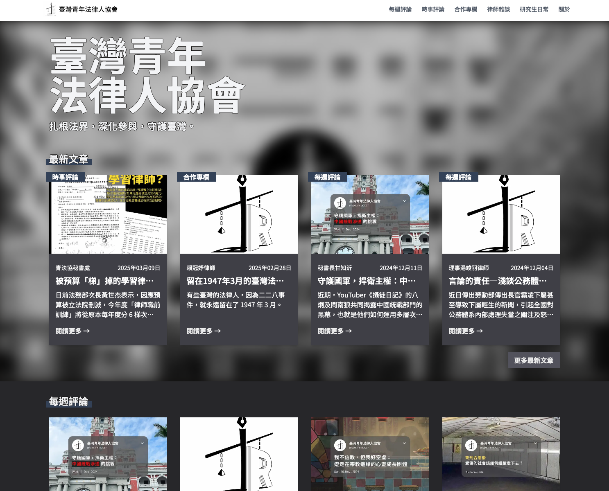

# 青法協資訊小組工作報告
報告人：江丞晉

---

## 一、已完成工作報告✅

---

### 1.網站介紹

臨時網址：[https://bera2017.org](https://bera2017.org)



---

### 2.網站後台

暫時使用 notion：
- 優點：不用 CMS 建置成本低
- 缺點：靈活性低

未來視業務情況調整是否需要擴充硬體設備或轉移資料庫

---

## 二、未來工作計畫🗒

---

### 1.網址更改（配合新開設 google workspace）

> yjat2017.org

---

### 2.網站功能維護與上線

issue: 
- 文章縮圖無法顯示

feature: 
- seo相關工作
  - 使用對 seo 友善網址
  - 強化各文章程式面對 google 搜尋引擎的友善程度 

```bash
# 目前
bera2017.org/posts/1e9ac461-630f  

# 修改後
bera2017.org/posts/taiwan-lawyers-1947
```


---
## 部署與ci/cd

- CI/CD 簡介
- 平台方案與費用評估
    - vercel
    - zeabur


